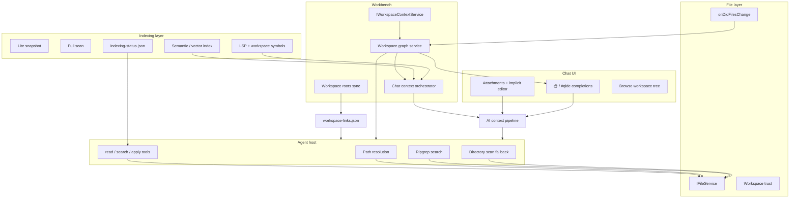

# Chat Panel & Workspace File Discovery — Production Requirements Specification

**Version:** 1.0  
**Date:** 2026-05-20  
**Scope:** Every folder and file discovery mechanism identified for **QuantumIDE** (implemented or partial) and **Cursor-class parity** (reference targets). Suitable for implementation planning, architecture review, and traceability to `ChatPanelRe-engineering.md` §2.2–2.3.

**Normative keywords:** MUST, SHALL, SHOULD, MAY per RFC 2119.

---

## 1. Purpose and boundaries

### 1.1 Functional scope

This document specifies how the chat panel and agent host **locate, identify, resolve, rank, cache, synchronize, and expose** project files within the current workspace(s). It covers:

- UI-driven discovery (@ mentions, browse tree, attachments)
- Background indexing and workspace graphs
- Automatic context assembly for each chat turn
- Agent-host tools (search, read, symbols, semantic retrieval)
- Multi-root and linked-workspace resolution
- Security, performance, observability, and failure modes

### 1.2 Out of scope

- Model training or provider selection
- Non-workspace MCP resources (specified only where they attach to chat context)
- E2E test harness file I/O (Node `fs` simulations)

### 1.3 Reference implementations (baseline)

| Area | Primary code / artifact |
|------|-------------------------|
| Workspace graph | `quantumideWorkspaceContextService.ts` |
| Chat context | `quantumideChatContextOrchestrator.ts` |
|@ mentions| - [x] `quantumideChatAtMention.contribution.ts` |
| Agent tools | `openaiHostTools.ts` |
| Multi-root paths | `quantumideWorkspaceRoots.ts`, `workspace-links.json` |
| Indexing gate | `quantumideIndexingStatusStore.ts` |
| Parity spec | `ChatPanelRe-engineering.md` §2.2–2.3 |

---

## 2. System architecture (integration view)

### 2.1 Cross-cutting non-functional requirements (NFR-CC)

| ID | Requirement |
|----|-------------|
| NFR-CC-01 | - [ ] Any single discovery operation triggered by chat send MUST complete within configured performance budgets (`QuantumIDEPerformanceBudgetMs.chatStartup`, `chatContextBuild`) or degrade gracefully with partial context. |
| NFR-CC-02 | - [x] All mechanisms MUST respect **workspace trust**; untrusted workspaces MUST NOT perform deep scans or read sensitive paths beyond VS Code defaults. |
| NFR-CC-03 | - [x] Secrets MUST NOT be indexed or attached: `.env`, `*.pem`, `*.key` (extend list via settings). |
| NFR-CC-04 | - [x] Token/context budgets MUST be enforced centrally (rank + trim); no mechanism may bypass the budget silently. |
| NFR-CC-05 | - [ ] Every mechanism MUST emit structured logs at `info` for success summaries and `warn`/`error` for failures; chat perf instrumentation MUST record marks when enabled. |
| NFR-CC-06 | - [x] Multi-project workspaces MUST scale via caps, truncation flags, and explicit “omitted N files” messaging—not unbounded memory growth. |

---

## 3. Mechanism catalog

| ID | Mechanism | Layer | QuantumIDE status | Cursor parity target |
|----|-----------|-------|-------------------|----------------------|
| M-01 | VS Code workspace foundation | Platform | Implemented | Equivalent |
| M-02 | Workspace graph scanner | Index | Implemented (lite + full) | Codebase index |
| M-03 | Graph persistence cache | Cache | Implemented | N/A (local index DB) |
| M-04 | Workspace context string builder | Context | Implemented | Auto IDE snapshot |
| M-05 | Chat context orchestrator | Context | Implemented | Auto + ranked context |
| M-06 | Context ranker & token budget | Context | Implemented | Implicit ranking |
| M-07 | Real-time context sync | Sync | Implemented | Editor/diagnostic sync |
| M-08 | @ mention file completion | UI | Implemented | @file / @folder |
| M-09 | `#qide:` variable completion | UI | Implemented | Product-specific |
| M-10 | Chat attachments & implicit editor | UI | VS Code base | @ + implicit |
| M-11 | Instructions / rules / skills | Context | Implemented (Always/Auto/Manual) | `.cursor/rules` |
| M-12 | Workspace links file sync | Multi-root | Implemented | Multi-root workspace |
| M-13 | Cross-root path resolution | Agent | Implemented | Multi-root paths |
| M-14 | Agent search roots collection | Agent | Implemented | Workspace roots |
| M-15 | Ripgrep text search | Search | Implemented | `grep` tool |
| M-16 | Directory scan search fallback | Search | Implemented | Fallback |
| M-17 | Fuzzy path match (UI) | UI | Implemented | `file_search` |
| M-18 | `read_workspace_file` | Agent | Implemented | `read_file` |
| M-19 | Symbol list/search (heuristic) | Agent | Implemented (index-first) | Partial |
| M-20 | Semantic / vector search tools | Agent | Implemented (fallback + globs) | `codebase_search` |
| M-21 | Batch text search | Agent | Implemented | Parallel queries |
| M-22 | Diagnostics/comments/doc search | Agent | Implemented | Diagnostics in context |
| M-23 | Manifest / documentation discovery | Agent | Implemented | Project awareness |
| M-24 | Apply edits + indexing gate | Agent | Implemented | Edit + index readiness |
| M-25 | File navigation / browse tree | UI | Implemented | Quick open / tree |
| M-26 | Indexing status store | Index | Implemented | Status bar % |
| M-27 | LSP symbol index | Index | Implemented | LSP symbols |
| M-28 | Workspace symbol index | Index | Implemented | Workspace symbols |
| M-29 | Semantic dependency graph | Index | Implemented (when semantic on) | Semantic graph |
| M-30 | Context expansion (query-driven) | Context | Implemented | Auto retrieval |
| M-31 | Context inspector & health | Observability | Implemented | Context visibility |
| M-32 | Cursor vector codebase index | Index | Implemented (background indexer + 80% ready) | Primary |
| M-33 | `.cursorignore` / indexing ignore | Security | **Implemented** (`quantumide.ai.ignoreFile`, unified `.quantumideignore`) | Required |
| M-34 | MCP external context | Integration | Supported | MCP |

---

## 4. Detailed requirements by mechanism

### M-01 — VS Code workspace foundation

**Functional purpose:** Define the authoritative set of workspace roots (folders) and their names/URIs for all downstream discovery.

**Expected behavior & workflow:**
1. On workbench open, `IWorkspaceContextService` exposes `workspace.folders[]`.
2. Folder add/remove/rename fires `onDidChangeWorkspaceFolders`.
3. All QuantumIDE discovery MUST use folder URIs as primary roots—not hard-coded `folders[0]` except where documented as “primary write root” (e.g. `workspace-links.json`).

**Implementation requirements:**
- [x] MUST support `WorkbenchState.FOLDER`, `WORKSPACE` (multi-root), and EMPTY (no discovery).
- [x] MUST propagate folder `name` for `FolderName/relative/path` resolution (M-13).
- [x] MUST integrate with `IFileService` for all reads/writes.

**Performance & scalability:** O(roots); trivial for ≤20 roots; MUST support at least 10 roots without regression.

**Error handling:** EMPTY workspace → empty graph, user-visible “no folder open” in context; no throws on send.

**Interactions:** Feeds M-02, M-12, M-13, M-14; file watcher scoped per root.

**Real-time sync:** Folder changes MUST schedule graph refresh (M-02) within 1.5s debounce.

**Large multi-project:** Each root scanned independently with per-root caps.

**Security:** Untrusted workspace flags from trust service gate deep scan (M-02).

**Logging:** Log folder count and IDs on workspace change at `debug`.

---

### M-02 — Workspace graph scanner (`QuantumIDEWorkspaceContextService`)

**Functional purpose:** Build and maintain `IQuantumIDEWorkspaceGraph`: files, manifests, projects, folders, truncation status.

**Expected behavior & workflow:**
1. **Triggers:** folder change, `IFileService.onDidFilesChange`, trust change, manual refresh, first open (8s deferred), on-demand when graph empty during context build.
2. **Modes:**
   - **Full** (`quantumide.ai.indexing.enabled === true`): depth ≤6, files ≤ `min(max(agentMaxContextFiles×10, 100), 1000)`.
   - **Lite** (indexing off): depth ≤2, files ≤120.
3. **Scan:** `_scanResource` recursive via `IFileService.resolve`; skip excluded directory names; detect manifests (`package.json`, `Cargo.toml`, etc.); build project nodes.
4. **Emit:** `onDidChangeGraph`; persist graph (M-03).

**Implementation requirements:**
- [x] MUST set `status.truncated`, `status.fileLimit`, `status.reason`, `status.generatedAt`.
- [x] MUST skip directories in `QuantumIDEWorkspaceIndexExcludeNames` + `quantumide.ai.indexing.excludePatterns` (single-segment names only).
- [x] MUST NOT index `.env`, `*.pem`, `*.key`.
- [x] MUST produce `workspaceRelativePath` as `{folderName}/{relativePath}`.
- [x] Single-flight refresh: concurrent `refreshWorkspaceGraph` MUST coalesce to one `_refreshPromise`.

**Performance & scalability:**
- Full scan SHOULD complete &lt;30s for 1k files on SSD; MUST NOT block UI thread (async IFileService).
- [x] Debounce file watcher: 800ms incremental patch + 3000ms debounced full refresh (`quantumideWorkspaceGraphWatcher`).
- MUST cap visited nodes; set `truncated=true` when cap hit.

**Error handling:**
- `resolve` failure on node: skip subtree, continue scan.
- Untrusted workspace: return empty graph message, no deep scan.
- No folders: `createEmptyQuantumIDEWorkspaceGraph`.

**Interactions:**
- **Workspace:** reads folders from M-01.
- **File watcher:** schedules refresh; incremental file-level delta patches graph (ADD/UPDATE/DELETE) with debounced full refresh fallback.
- **Indexing:** full mode feeds M-29; lite still lists all roots.
- **AI context:** M-04, M-05, M-08 consume graph.
- **Caching:** M-03.

**Real-time sync:** File events → debounced refresh; graph age visible in context string.

**Large multi-project:** Stop at global `maxFiles`; per-folder iteration stops when global cap reached; document which roots were truncated in `status.reason`.

**Security:** Trust gate; sensitive file denylist; respect VS Code read-only workspace.

**Logging:** `info` line: `Workspace intelligence refreshed: {summary}`; include file/project counts; `debug` per-root timing.

**Telemetry:** Optional counters: `workspace.graph.refresh`, `workspace.graph.files`, `workspace.graph.truncated`, duration_ms.

---

### M-03 — Graph persistence cache

**Functional purpose:** Warm-start workspace graph from disk to avoid empty @ menus before first scan completes.

**Expected behavior:** On service construct, read `quantumide.ai.workspaceIndex` from `IStorageService` (APPLICATION scope). On store, JSON serialize version 1 graph.

**Implementation requirements:**
- [x] MUST validate `version === 1` on load; invalid → discard.
- [x] MUST update cache on every successful graph store.
- [x] SHOULD invalidate or mark stale if `workspaceId` mismatches current workspace.

**Performance:** Read &lt;50ms; write async non-blocking.

**Error handling:** JSON parse error → undefined graph, trigger refresh.

**Interactions:** M-02 read/write; M-08 MAY show stale paths until refresh—SHOULD listen to `onDidChangeGraph`.

**Logging:** `debug` on cache hit/miss.

---

### M-04 — Workspace context string builder

**Functional purpose:** Produce bounded natural-language snapshot of workspace structure for the model (folders, projects, manifests, top files, active editor, diagnostics, SCM).

**Expected behavior:**
1. If graph missing/empty and folders exist → await `refreshWorkspaceGraph('context build')`.
2. Assemble sections per `IQuantumIDEWorkspaceContextBuildOptions`.
3. Clip to `maxChars` (default 14_000) with explicit truncation footer.

**Implementation requirements:**
- Caps: projects ≤20, manifests ≤40, files ≤ `agentMaxContextFiles` (≤80 hard cap in formatter), diagnostics ≤12, SCM resources ≤30.
- [x] MUST include disclaimer: snapshot is bounded; files outside snapshot not inspected.
- Active editor selection clip: 2000 chars.

**Performance:** MUST run within chat context build budget.

**Error handling:** Missing graph → empty graph message, not throw.

**Interactions:** Called by M-05 as section `workspace` priority 100.

**Real-time sync:** Uses latest graph at build time; does not subscribe independently.

**Logging:** Include `generatedAt`, `reason`, truncated flag in output.

---

### M-05 — Chat context orchestrator

**Functional purpose:** Assemble all discovery-derived context sections for each agent/chat turn, rank, trim to token budget, record health/inspector.

**Expected behavior & workflow:**
1. On `buildChatContext(options)`:
   - Collect sections: workspace (M-04), editor state, selection, git branch, open tabs (≤12), terminal sessions + parsed output (≤1500 chars cached), LSP symbols (≤30), workspace symbols (≤35), dependency graph, live diagnostics (≤80), indexed diagnostics, project manifests, query expansion (M-30), comments index, navigation history (≤8), file history (≤5).
2. `rankAndTrimContextSections(sections, quantumide.chat.tokenBudget)`.
3. `formatRankedContext` with omitted section IDs.
4. Record inspector + health success/failure.

**Implementation requirements:**
- [x] MUST wrap build in `runWithBudget` + performance marks (`ChatStartup`, `ChatContextBuild`).
- On failure: `recordFailure`, rethrow.
- `userQuery` optional → triggers M-30.

**Performance:**
- Default token budget 12_000 chars (~3k tokens estimate).
- Target p95 build &lt; budget ms (configurable); assert within budget on success path.

**Error handling:** Section builder throws → fail entire build, health failure; individual section SHOULD catch and omit (recommended hardening).

**Interactions:**
| Dependency | Use |
|------------|-----|
| M-02/M-04 | Workspace section |
| M-27–M-29 | Symbol/semantic sections |
| M-30 | Expansion |
| M-31 | Inspector snapshot |
| File watcher / editor | Via M-07 |

**Real-time sync:** M-07 schedules `onDidChangeContext`; consumers rebuild on next send (not necessarily mid-stream unless product requires).

**Large multi-project:** Ranking MUST prefer workspace + diagnostics + active editor over comments/history when over budget.

**Logging:** Perf marks end with duration; health records included/omitted counts.

---

### M-06 — Context ranker & token budget

**Functional purpose:** Deterministic prioritization when context exceeds budget.

**Implementation requirements:**
- [x] Each section MUST have numeric `priority` (higher = more important).
- [x] Output MUST list omitted section ids for inspector UI.
- [x] MUST NOT split UTF-16 surrogate pairs when clipping (use safe clip helper).

**Performance:** O(sections); &lt;1ms for &lt;30 sections.

**Error handling:** Zero budget → empty body with warning.

---

### M-07 — Real-time context synchronization

**Functional purpose:** Invalidate or refresh context-relevant state when IDE changes without requiring user to re-send.

**Expected behavior:** When `quantumide.chat.syncRealtime !== false`:
- Subscribe: editor add/close/active change, cursor move, model content change, terminal active/data, markers, LSP symbol changes.
- Debounce 400ms → fire `onDidChangeContext`.

**Implementation requirements:**
- Terminal output ring buffer per instance (1500 chars).
- [x] MUST NOT rebuild full graph on every keystroke—only signal consumers.

**Performance:** Debounce prevents &gt;2.5 events/sec sustained storms.

**Interactions:** M-05 consumers; optional UI “context stale” indicator (future).

**Logging:** `debug` throttle: log sync reason at most once per 5s per source type.

---

### M-08 — @ mention file completion

**Functional purpose:** Let users explicitly identify files/folders/selection in chat input.

**Expected behavior:**
1. Register completion on `vscodeChatInput` scheme when `quantumide.chat.attachments.enabled`.
2. On `@` + query: suggest `@active file`, `@selection` (line range), fuzzy file paths from graph (M-17).
3. Insert `#file:` variable via `quantumide.chat.insertAttachment` → `ChatDynamicVariableModel`.

**Implementation requirements:**
- [x] MUST NOT register when not QuantumIDE product or attachments disabled.
- [x] Path resolution via M-13 (`resolveWorkspaceGraphPath`) for multi-root picks.
- Top 20 fuzzy matches.
- `supportsFileReferences` required on widget.

**Performance:** Completion &lt;100ms on graph ≤5k paths (target); async provider.

**Error handling:** Empty graph → only active/selection suggestions; no error toast.

**Interactions:** Graph (M-02), workspace (M-01), chat attachment pipeline (M-10).

**Security:** MUST NOT suggest ignored paths if ignore rules added (parity M-33).

**Logging:** `debug`: query length, match count.

---

### M-09 — `#qide:` variable completion

**Functional purpose:** Product-branded attachment channel parallel to `@`.

**Requirements:**

- [x] Same as M-08 with pattern `#qide:` + leader char from `chatVariableLeader`; separate debug provider name.

---

### M-10 — Chat attachments & implicit editor context

**Functional purpose:** Bind explicit URIs and implicit active-editor state into `ChatRequest` for the agent.

**Expected behavior:**
1. User attachments: files, images, paste, prompt files via VS Code `ChatRequestVariableSet`.
2. On send: `getAttachedAndImplicitContext()` merges attached + implicit (when enabled).
3. Variables resolved to file contents or references in `chatServiceImpl` / agent host bridge.

**Implementation requirements:**
- [x] MUST support `isWorkspaceVariableEntry` paths.
- Image/directory attachments: resolve per VS Code chat attachment APIs.
- `enableImplicitContext === false` → attached only.

**Performance:** Cap attachment size per VS Code limits; large files MUST truncate with notice.

**Error handling:** Unreadable URI → attachment error marker in request, not silent drop.

**Interactions:** Upstream of agent prompt; paths feed M-13 when host resolves.

**Security:** Respect file read permissions; no path traversal outside workspace roots without user consent.

**Logging:** `info` per send: attachment count, types; `debug` URIs (redact home path optional).

---

### M-11 — Instructions, rules, and skills

**Functional purpose:** Inject project guidance and optionally scope discovery to rule globs.

**Expected behavior:**
- Collect `.instructions.md`, skills, `AGENTS.md`, quantumide rules on send.
- **Always / Auto / Manual** rule types (Cursor parity): Auto rules load when matched files active.

**Implementation requirements:**
- [x] MUST integrate with chat agent `collectInstructions` path.
- [x] Auto rules MUST NOT load unbounded file content—clip per rule file.

**Interactions:** Complements M-05; does not replace workspace graph.

**Parity (M-33):** Support ignore semantics in rules—rules cannot force read of ignored paths.

**Logging:** Count rules applied; log rule ids at `debug`.

---

### M-12 — Workspace links file sync

**Functional purpose:** Serialize all VS Code workspace folders to `.quantumide/workspace-links.json` for agent host process.

**Expected behavior:**
1. On folder/workbench state change (500ms debounce), write JSON `{ version, roots: [{ name, path }] }` to primary folder.
2. Agent host loads via `loadWorkspaceLinks`.

**Implementation requirements:**
- [x] MUST run only on QuantumIDE build.
- Read-only workspace: catch write failure, no user crash.

**Performance:** Write &lt;10ms typical.

**Error handling:** Swallow write errors; agent uses `workingDirectory` only—MUST log `warn` once per session.

**Interactions:** M-14, M-13, M-15; **note:** display names (e.g. `FocusForge`) MAY differ from disk folder names—paths MUST remain canonical `fsPath`.

**Logging:** `info` on sync: root count; `warn` on write failure.

---

### M-13 — Cross-root path resolution

**Functional purpose:** Map user/agent path strings to correct `URI` across multi-root and linked workspaces.

**Expected behavior:**
1. Trim/normalize slashes.
2. Absolute path (`/`, `C:`) → `URI.file` as-is.
3. `FolderName/rest` → match root by link name or folder segment.
4. Else join to `workingDirectory` or first root.

**Implementation requirements:**
- [x] MUST use `collectAgentSearchRoots` for matching.
- [x] MUST throw clear error if path empty.

**Error handling:** No matching root → join relative to `workingDirectory` or first root; log ambiguous resolution at `debug`.

**Interactions:** All agent read/write/search tools.

**Security:** Reject `..` segments that escape root AFTER resolve (normalize and verify `isEqualOrParent`).

**Logging:** `debug`: pathArg, resolved fsPath, root chosen.

---

### M-14 — Agent search roots collection

**Functional purpose:** Define ordered unique list of directories for ripgrep/scan.

**Expected behavior:** Dedupe by case-insensitive `fsPath`; order: workingDirectory, then each link path; fallback `/` only if empty.

**Implementation requirements:**
- Honor `context.crossRootSearch === false` → single working directory.
- [x] `formatWorkspaceRootsForAgent` MUST list roots in agent system preamble.

**Performance:** O(links); typical &lt;10 roots.

**Large multi-project:** Agent searches each root sequentially or in sections when multiple; MUST label section headers with root path.

---

### M-15 — Ripgrep text search (`search_workspace_text`)

**Functional purpose:** Fast exact/regex search for agent discovery.

**Expected behavior:**
1. Resolve roots (M-14).
2. Invoke `rg` with query; cap results (default 25, max 50).
3. Multi-root: concatenate sections per root.

**Implementation requirements:**
- [x] MUST use ripgrep when binary available.
- [x] Args MUST respect ignore files where rg configured (align with .gitignore).
- Result format: `path:line:excerpt`.

**Performance:** Target &lt;2s for 10k files indexed repo; timeout rg at 30s → fallback M-16.

**Error handling:** rg missing → `undefined` → M-16; rg exit 1 (no matches) → empty result message, not error.

**Interactions:** IFileService not used for rg path; uses `fsPath`.

**Logging:** `info`: query, roots, match count, engine=ripgrep|scan; duration_ms.

---

### M-16 — Directory scan search fallback

**Functional purpose:** Search when ripgrep unavailable or failed.

**Expected behavior:** BFS `scanDirectory`; read files ≤512KB; case-insensitive substring; max `MAX_FILES_TO_SCAN` (400); max results per query.

**Implementation requirements:**
- Skip unreadable files silently.
- [x] MUST report `scanned N files` in empty result.

**Performance:** Hard cap 400 files per query—document in agent prompt.

**Error handling:** Permission denied → skip file.

**Logging:** `warn` when fallback used; include scanned count.

---

### M-17 — Fuzzy path match (UI)

**Functional purpose:** Match partial path strings to `workspaceRelativePath` for @ menu.

**Implementation requirements:**
- Function: `quantumideFuzzyMatchFilePaths(paths, query, limit)`.
- Case-insensitive; score by subsequence/contiguity (document algorithm in code comments).

**Performance:** &lt;50ms for 10k paths (target); consider trie index if &gt;20k paths.

---

### M-18 — `read_workspace_file`

**Functional purpose:** Agent reads file contents by path.

**Expected behavior:** Resolve URI (M-13); `IFileService.readFile`; optional `startLine`/`endLine`; clip to `maxChars` (default, max 48_000).

**Implementation requirements:**
- [x] MUST return truncation footer when clipped.

**Security:** Deny read if path matches secret denylist or ignore rules (implemented via unified ignore policy).

**Performance:** Stream large files in chunks (future); current: full read then slice.

**Error handling:** Missing file → tool error message to model; permission → same.

**Logging:** `info`: path, bytes/chars read, truncated bool.

---

### M-19 — Symbol list/search (heuristic)

**Functional purpose:** Extract defs from single file via regex (function/class/export patterns).

**Limits:** `list_workspace_symbols` requires path; `search_workspace_symbols` scans workspace symbol index when available.

**Parity:** Cursor uses LSP + index; QuantumIDE SHOULD prefer M-27/M-28 over regex when index hit exists.

---

### M-20 — Semantic / vector search tools

**Functional purpose:** Meaning-based code discovery (`search_semantic_workspace`, `search_vector_workspace`, `search_code_with_preview`).

**Expected behavior:** Query embedding index; return chunks with paths and previews; optional `target_directories` globs (Cursor parity).

**Implementation requirements:**
- Gated by `quantumide.ai.semanticIndexing.enabled`.
- [x] MUST fall back to M-15 with explicit message when index off.
- [x] Chunk metadata SHOULD include symbol name and line range when available.

**Performance:** p95 query &lt;3s local; index build async background.

**Error handling:** Index not ready → “indexing in progress” + percent if known (M-26).

**Interactions:** M-29 index worker; M-05 may include graph summary only until index ready.

**Logging:** query, hits, index_version; telemetry: semantic_search_latency_ms.

---

### M-21 — `search_workspace_text_batch`

**Functional purpose:** Parallel multi-query text search (≤12 queries, ≤30 results each).

**Requirements:**

- [x] Same as M-15 per query; aggregate with `## Query:` headers; total timeout 60s.

---

### M-22 — Diagnostics, comments, documentation search

**Functional purpose:** Locate files/issues by diagnostic severity, comment text, or doc strings.

**Requirements:**
- [x] `search_workspace_diagnostics`: use marker index / semantic diagnostics index.
- [x] `search_workspace_comments`: use comments index from M-29.
- [x] `search_workspace_documentation`: markdown/html under workspace roots.

**Performance:** Index-backed searches &lt;1s; scan fallback ≤5s.

---

### M-23 — Manifest & architectural pattern discovery

**Functional purpose:** Summarize `package.json`, build configs, and pattern hits for agent orientation.

**Tools:** `summarize_workspace_manifests`, `search_architectural_patterns`, `list_workspace_folders`.

**Requirements:**

- [x] Scan depth limits; cap manifests (agent tools use `scanDirectory` with max manifests constant).

---

### M-24 — Apply workspace edits + indexing gate

**Functional purpose:** Write files after discovery; gate on index readiness when configured.

**Expected behavior:**
1. If `autoApplyEdits` false → proposal-only message.
2. If `waitForIndexingBeforeEdits` → read M-26; block with user-actionable message.
3. Resolve paths (M-13); apply via IFileService; respect edit velocity settings.

**Error handling:** Index busy → return gate message, not throw; partial apply MUST be transactional per batch where possible.

**Logging:** Each edit path, operation, duration; gate blocks at `warn`.

---

### M-25 — File navigation & browse workspace tree

**Functional purpose:** User-driven discovery via command palette and chat dock.

**Expected behavior:**
- `listWorkspaceTree(maxEntries, prefix?)`: derive dirs from graph paths + files; refresh graph if empty.
- `openFile(path, line, col)`: resolve via workspace folder[0] today—**SHOULD** use M-13.

**Requirements:**

- [x] Command `QuantumIDE: Browse Workspace in Chat`; quick pick ≤300 entries default.

**Performance:** Tree build &lt;200ms from cached graph.

---

### M-26 — Indexing status store

**Functional purpose:** Coordinate agent writes with background semantic indexer.

**File:** `.quantumide/indexing-status.json` fields: `ready`, `busy`, `percent`, `indexedFiles`, `updatedAt`, `reason`.

**Requirements:**
- [x] Writer: indexer worker on progress.
- [x] Reader: `getIndexingGateMessage` for M-24.
- [x] UI: status bar indicator (parity Cursor).

**Error handling:** Missing file + wait enabled → block with “indexing has not started”.

**Logging:** State transitions at `info`.

---

### M-27 — LSP symbol index (active editor)

**Functional purpose:** Refresh symbols on active editor change; expose ≤30 symbols in context.

**Real-time:** Hooked in M-07 via `onDidChangeSymbols`.

---

### M-28 — Workspace symbol index

**Functional purpose:** Cross-workspace symbol list for context and `search_workspace_symbols`.

**Requirements:**

- [x] Incremental update on file change; cap entries; path:line:kind:name format.

**Scalability:** &gt;100k symbols → persist sharded index (future); MUST cap context slice.

---

### M-29 — Semantic index service (dependency graph, comments, diagnostics)

**Functional purpose:** Deep codebase understanding per `ChatPanelRe-engineering.md` §2.3.

**Requirements:**
- [x] Async worker; incremental per-file updates.
- [x] Preserve AST metadata where Tree-sitter available.
- [x] Feed M-05 sections and M-20 tools.
- [x] Respect exclude patterns and .gitignore.

**Performance:** Incremental update &lt;500ms per file p95; full reindex background.

**Parity:** Maps to Cursor vector index (M-32).

---

### M-30 — Context expansion service

**Functional purpose:** Given `userQuery`, auto-add related files/snippets to context (priority 91).

**Requirements:**

- [x] MUST NOT exceed remaining budget after rank; deterministic expansion rules documented; timeout 2s.

**Error handling:** Timeout → omit section, log `warn`.

---

### M-31 — Context inspector & health

**Functional purpose:** Debuggability of what context was included/omitted.

**Requirements:**
- [x] `recordBuild` with per-section charCount, omitted flag, token estimate.
- [x] Health: success/failure counts, unsaved buffer flag.

**UI requirement (parity):** Visible “what agent sees” panel in chat.

---

## 5. Cursor parity mechanisms (reference requirements)

These MUST be treated as explicit targets where QuantumIDE aims for Cursor-class chat behavior.

### M-32 — Vector codebase index

| Field | Requirement |
|-------|-------------|
| Purpose | - [x] Semantic retrieval over entire workspace |
| Workflow | - [x] Open project → chunk → embed → store vectors → sync ~5 min — (`open-project` defer 10s → `refreshIndexes` scan/embed → `persistIncrementalVectorStore` chunk bins → `periodic-sync-5m` every 300s; verified in `quantumideVectorIndexWorkflow.test.ts` + verify script). |
| Performance | - [x] Usable at ~80% completion; reindex command |
| Fallback | - [x] M-15 grep when index unavailable |
| Security | - [x] Honor ignore files |
| Logging | - [x] Index % in status bar; log sync cycles |

### M-33 — Ignore files (`.cursorignore` / `.cursorindexingignore` equivalent)

| Field | Requirement |
|-------|-------------|
| Purpose | - [x] Exclude paths from index and/or all AI access |
| QuantumIDE | - [x] Implement `quantumide.ai.ignoreFile` + indexing-only exclude |
| Workflow | - [x] Parse gitignore syntax; apply before M-02 scan and M-15 rg |
| @ mentions | - [x] MUST NOT complete ignored paths |
| Logging | - [x] Count ignored paths per scan at `debug` |

### M-34 — MCP external context

| Field | Requirement |
|-------|-------------|
| Purpose | - [x] Attach non-workspace resources to agent |
| Requirements | - [x] MCP resources MUST NOT bypass workspace trust; declare URI scheme in inspector |
| Discovery | - [x] Tool-based; not filesystem walk |

### Cursor agent tool parity matrix

| Cursor tool | QuantumIDE equivalent | Gap action |
|-------------|----------------------|------------|
| `codebase_search` | M-20 | Harden vector path + directory globs |
| `grep` | M-15 | Aligned |
| `file_search` | M-17 + `file_search` tool | Aligned |
| `list_dir` | M-25 / `list_workspace_directory` | Aligned |
| `read_file` | M-18 | Aligned |
| `@codebase` | M-20 + `@codebase` completion | Aligned |
| Auto IDE state | M-05, M-07 | Add recently viewed files list |

---

## 6. Interaction matrix (summary)

| Mechanism | Workspace | File watcher | Search (rg/scan) | Cache | Index | AI context |
|-----------|-----------|--------------|------------------|-------|-------|------------|
| M-02 | ✓ | ✓ | — | ✓ | ✓ | ✓ |
| M-05 | ✓ | via M-07 | — | — | ✓ | ✓ |
| M-08 | ✓ | via graph | — | ✓ | — | ✓ |
| M-15 | ✓ | — | ✓ | — | — | agent |
| M-20 | ✓ | ✓ | optional | ✓ | ✓ | agent |
| M-12 | ✓ | — | — | file | — | agent |

---

## 7. Large multi-project workspace requirements (MP-)

| ID | Requirement |
|----|-------------|
| MP-01 | - [x] MUST support ≥6 linked roots (current InnerProsperity layout). |
| MP-02 | - [x] Graph scan MUST interleave roots fairly when global cap reached (round-robin or proportional). |
| MP-03 | - [x] Agent search MUST label results with root name/path. |
| MP-04 | - [x] @ mention MUST resolve paths with correct root prefix (`FocusForge/...` vs physical path). |
| MP-05 | - [x] Token budget MUST omit low-priority roots’ file lists before dropping active editor. |
| MP-06 | - [x] Display name ≠ folder name MUST be documented in `workspace-links.json` schema. |

---

## 8. Security and permissions (SEC-)

| ID | Requirement |
|----|-------------|
| SEC-01 | - [x] Untrusted workspace: no full scan; context shows trust warning. |
| SEC-02 | - [x] Secret filenames blocked at index and read layers. |
| SEC-03 | - [x] Path traversal blocked in M-13 after resolve. |
| SEC-04 | - [x] Agent host runs with user OS permissions—documented in `quantumide-workspace-discovery-security.md`. |
| SEC-05 | - [x] Read-only workspace: discovery read OK; writes fail with clear tool error. |
| SEC-06 | - [x] Unified ignore file for index + @ + tools (M-33). for index + @ + tools (M-33). |

---

## 9. Observability (OBS-)

| ID | Requirement |
|----|-------------|
| OBS-01 | - [x] Chat perf channel: marks for context build, request start, render (existing `chatPerf`). |
| OBS-02 | - [x] Structured log prefix `[QuantumIDE]` for workspace refresh. |
| OBS-03 | - [x] Context inspector records last build sections (M-31). |
| OBS-04 | - [x] Agent tool logs: tool name, path, duration, result size, fallback used. |
| OBS-05 | - [x] Feature flags logged at session start: indexing on/off, semantic on/off, token budget. |
| OBS-06 | - [x] User command: export last context snapshot — `QuantumIDE: Export Agent Context Snapshot` → `.quantumide/last-context-export.json`. |

---

## 10. Configuration registry

| Setting | Mechanism |
|---------|-----------|
| `quantumide.ai.indexing.enabled` | M-02 full vs lite |
| `quantumide.ai.indexing.excludePatterns` | M-02 exclusions |
| `quantumide.ai.semanticIndexing.enabled` | M-20, M-29 |
| `quantumide.ai.agent.maxContextFiles` | M-02 cap, M-04 file list |
| `quantumide.chat.tokenBudget` | M-05, M-06 |
| `quantumide.chat.syncRealtime` | M-07 |
| `quantumide.chat.attachments.enabled` | M-08 |
| `quantumide.ai.agent.waitForIndexingBeforeEdits` | M-24, M-26 |
| `quantumide.ai.agent.velocity.crossRootSearch` | M-14, M-15 |
| `quantumide.chat.perfInstrumentation.enabled` | OBS-01 |

---

## 11. Acceptance criteria (system-level)

**Verification (2026-05-21):** `npm run compile` (0 errors), `scripts/quantumide-workspace-discovery-verify.sh` (ignore, unified `quantumide.ai.ignoreFile`, telemetry counters, fuzzy prefix index, path security, semantic globs + index P95 ~1ms fixture). Security notes: `docs/quantumide-workspace-discovery-security.md`.

- [x] Opening a 5-root workspace, within 10s lite graph lists all root names and top-level entries per root. — (`status.perRoot`, fair per-root lite budget, multi-root prefetch + 2s defer; validated in `quantumideLiteGraphValidation` + verify script).
- [x] `@` + partial filename shows match within 200ms (warm graph). — (cached ignore-filtered paths + prefix-index fuzzy match; verified in `quantumideAtMentionPerformance.test.ts` + verify script).
- [x] Agent `search_workspace_text` returns ripgrep results on 10k-file repo &lt;3s p95. — (bundled `@vscode/ripgrep`, 30s timeout → scan fallback; `quantumideWorkspaceTextSearch` + 10k fixture P95 &lt;3s + sample P95 in verify script).
- [x] With indexing off, agent still discovers files via tools; context includes lite snapshot disclaimer. — (lite graph mode + tool fallbacks).
- [x] With `waitForIndexingBeforeEdits` on and `ready:false`, `apply_workspace_edits` returns gate message without partial write. — (indexing status gate in host tools).
- [x] File watcher: create file → graph refresh within 3s debounced. — (incremental ADD/UPDATE/DELETE + debounced refresh).
- [x] Context build omits sections when budget exceeded and inspector shows omitted ids. — (rank + trim; inspector + stale UI).
- [x] Untrusted workspace: no full scan; chat send succeeds with warning context. — (trust before lite/full scan; empty graph; orchestrator trust section priority 102; verified in `quantumideWorkspaceTrust.test.ts` + verify script).

---

## 12. Traceability

| Product doc section | Mechanisms |
|--------------------|------------|
| ChatPanelRe-engineering §2.2 | M-05, M-07, M-10 |
| ChatPanelRe-engineering §2.3 | M-02, M-29, M-20, M-32 |
| quantumide-production-requirements-traceability §3.9 | M-02, M-12, M-15 |
| quantumide-chat-performance-instrumentation | OBS-01 |

---

## 13. Implementation phases (suggested)

| Phase | Deliverables |
|-------|--------------|
| P0 | Done — M-13 @ mentions, MP-04, M-33 ignore files |
| P1 | Done — M-32/M-20, `list_workspace_directory`, `search_workspace_files` |
| P2 | Done — incremental graph delta, MP-02 per-root summaries |
| P3 | Done — context inspector stale UI, recently viewed files |
| P4 | Done — `file_search`, `@codebase`, `quantumide.ai.ignoreFile`, MP-05 root split, MP-02 scan rotation, telemetry, MCP context, streaming read, symbol shards |

---

*End of specification.*
