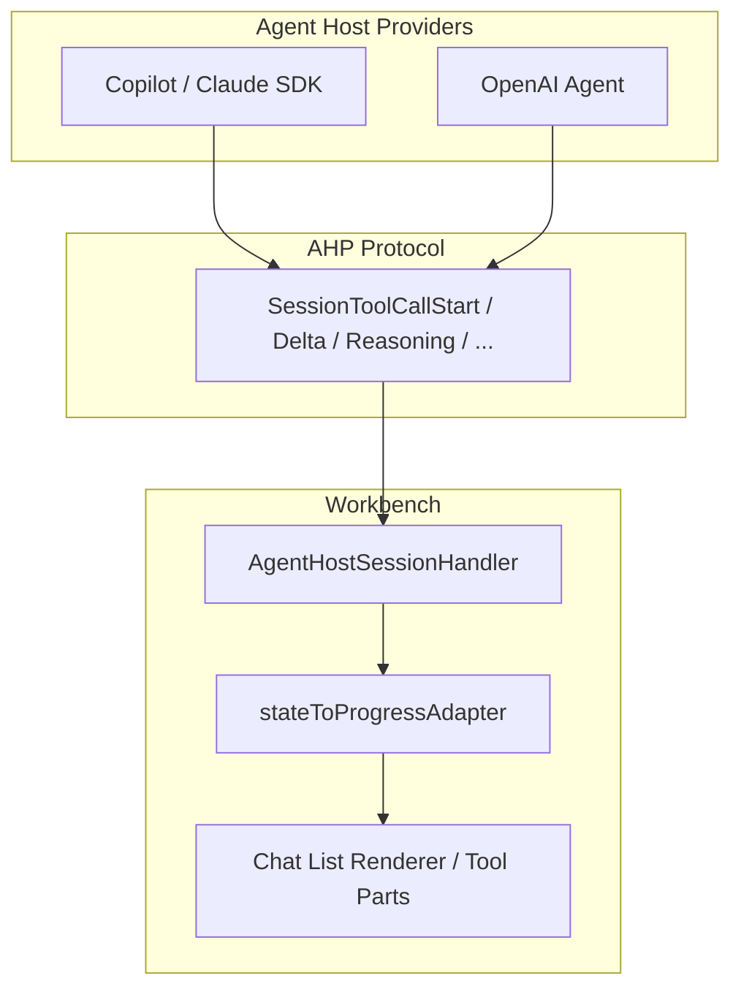

# QuantumIDE — Live Agent Activity (Tool Progress) Requirements

**Document ID:** QIDE-REQ-AGENT-ACTIVITY-001  
**Status:** Implemented (Cursor-parity labels, ripgrep search, UI polish)  
**Version:** 1.0  
**Last updated:** 2026-05-18  
**Owner:** QuantumIDE AI / Agent Host  
**Related work:** OpenAI response streaming (implemented); Copilot/Claude Agent Host protocol; [Agent Velocity](./quantumide-agent-velocity.md) (parallel/batch search, verify, rules, handoff)

---

## 1. Purpose

Define development requirements for a **full Cursor-class live agent activity experience** in QuantumIDE: while an agent works on a user request, the chat UI shows **incremental, human-readable steps** (e.g. searching the codebase, reading a file, running a terminal command, planning, calling a subagent) **before and during** the final assistant answer—not only a wall of text at the end.

This document is separate from **response text streaming** (token-by-token answer rendering), which is already implemented for the OpenAI-compatible provider path.

---

## 2. Background

### 2.1 What users see in Cursor (reference behavior)

During an agent turn, the user sees a **timeline of work**, such as:

- Searching / grepping the repository  
- Reading specific files  
- Planning or reasoning (optional collapsed section)  
- Running terminal commands  
- Applying edits  
- Final narrative answer (often streamed)

### 2.2 What AI models provide out of the box

| Capability | Provided by model API? | Provided by host app? |
|------------|------------------------|------------------------|
| Streaming answer text | Yes (`stream: true`) | UI renders chunks |
| Structured tool / function calls | Yes (JSON) | Host executes tools |
| Labels like “Grepping…” | **No** | **Yes** — client maps tool events to copy |
| Search/read/terminal execution | **No** | **Yes** — agent runtime + IDE integration |
| Activity timeline UX | **No** | **Yes** — chat renderer |

**Requirement implication:** Full feature delivery is **host + UI + agent loop** work, not a model settings toggle.

### 2.3 Current QuantumIDE baseline (as of 2026-05-18)

| Area | State |
|------|--------|
| Agent Host protocol | `SessionDelta`, `SessionToolCallStart`, `SessionToolCallReady`, `SessionToolCallComplete`, `SessionReasoning`, `SessionResponsePart`, etc. |
| Copilot / Claude providers | Emit rich stream of actions via SDK; observable session state drives UI via `_observeTurn` + `stateToProgressAdapter` |
| OpenAI provider | Text streaming + multi-step tool loop (`search_workspace_text`, `read_workspace_file`); live `SessionToolCall*` + `SessionReasoning`; cancel marks in-flight tools failed |
| Workbench chat UI | `toolInvocation` / `toolInvocationSerialized`, `thinking` progress kinds; OpenAI raw router; tests in `agentHostChatContribution.test.ts` |
| OpenAI raw progress path | `SessionDelta`, tool actions, and `SessionReasoning` routed for OpenAI even when observable progress is active |
| Session chrome | `SessionActivityChanged` on session list; **View → Output → QuantumIDE Agent** debug timeline |
| Cursor-style labels | Present-tense while running (`Grepping`, `Reading \`file\``) and past-tense when done (`Grepped`, `Read \`file\``); see `agentActivityLabels.ts` |
| Search | `search_workspace_text` uses **ripgrep** when available, directory scan fallback |
| UI polish | Per-kind **codicons** on tool cards; **expand/collapse** via `simpleToolInvocation` (search) and `resources` (read); **localized** labels in workbench |
| Status-only steps | `SessionActivityChanged` → in-chat `progressMessage` (Planning…); AC-12 dedicated `SessionActivity` action not added |
| Host tools (stretch) | `list_workspace_symbols` — regex-based symbol listing per file |
| Remaining gaps | Indexed/semantic codebase search (future); dedicated `SessionActivity` protocol action (optional) |

---

## 3. Goals

### 3.1 Primary goals

1. **Transparency** — User always knows what the agent is doing during a long turn.  
2. **Perceived responsiveness** — Steps appear within **500 ms** of the underlying action starting (where technically possible).  
3. **Provider parity** — Copilot, Claude, and OpenAI-compatible routes share the **same chat UX patterns** for activity (differences only where backend capability differs).  
4. **Correctness** — Activity steps reflect **actual** host actions; no fake “Grepping” without a search executing.

### 3.2 Non-goals (v1 unless marked stretch)

- Replacing the Agent Host protocol with a new event bus  
- Exposing raw model chain-of-thought that providers forbid logging  
- Remote/cloud-only agents without local Agent Host  
- Full parity with every Cursor subagent visualization in v1  

---

## 4. User stories

| ID | Story | Priority |
|----|--------|----------|
| US-1 | As a developer, I see **what the agent is doing right now** (not a blank wait) during long tasks. | P0 |
| US-2 | As a developer, I see **search/read/edit/terminal** steps with recognizable labels and expandable detail. | P0 |
| US-3 | As a developer, I can **expand/collapse** completed steps and still read the final answer. | P0 |
| US-4 | As a developer on **OpenAI-compatible** models, I get the same activity UX as on Copilot when tools run. | P0 |
| US-5 | As a developer, I see **failures** (tool denied, timeout, API error) as explicit steps, not silent drops. | P1 |
| US-6 | As a developer, I can **cancel** a turn and retain partial activity + partial answer. | P1 |
| US-7 | As a developer, I see **reasoning/thinking** in a dedicated area when the provider supports it. | P1 |
| US-8 | As a developer, session list / title shows **current activity** (e.g. “Reading `foo.ts`…”). | P2 |

---

## 5. Functional requirements

### 5.1 Activity step model

**FR-1** The system SHALL represent each unit of visible work as an **Activity Step** with at minimum:

| Field | Description |
|-------|-------------|
| `id` | Stable per turn (e.g. toolCallId or generated step id) |
| `kind` | Enum: `search`, `read`, `edit`, `terminal`, `tool`, `reasoning`, `plan`, `subagent`, `status`, `error` |
| `label` | Short user-facing string (e.g. “Searched codebase”, “Read `src/app.ts`”) |
| `detail` | Optional markdown/plain detail (query, path, command snippet) |
| `state` | `pending` \| `running` \| `completed` \| `failed` \| `cancelled` |
| `startedAt` / `endedAt` | Timestamps for ordering and duration display |
| `parentStepId` | Optional, for subagent nesting |

**FR-2** Activity steps SHALL be ordered chronologically within a turn.

**FR-3** The final assistant **answer** SHALL remain a distinct content region (markdown stream), not mixed into tool rows as plain text only.

### 5.2 Agent Host — event emission

**FR-10** For every provider integrated with QuantumIDE chat, the agent SHALL emit protocol actions such that the workbench can build activity steps:

| User-visible kind | Minimum protocol signals |
|-------------------|---------------------------|
| Tool execution | `SessionToolCallStart` → `SessionToolCallReady` → `SessionToolCallComplete` (or error) |
| Text answer | `SessionResponsePart` + `SessionDelta` |
| Reasoning | `SessionReasoning` or provider-equivalent |
| High-level status | `SessionDelta` with structured status **or** new `SessionActivity` action (see §6) |

**FR-11** **Copilot / Claude:** No regression; existing `stateToProgressAdapter` mapping MUST remain correct; add any missing labels for common tools (grep, read_file, edit, bash, task/subagent).

**FR-12** **OpenAI-compatible provider** SHALL NOT wait until the full completion blob to surface tool activity:

- When the model streams `tool_calls`, emit `SessionToolCallStart` when the **tool name** is known (extend current markdown hint to full tool invocation UI).  
- Execute QuantumIDE tools (search, read, propose edit, terminal) via the **same client-tool / approval pipeline** as other providers where applicable.

**FR-13** **Search / grep** (when implemented for OpenAI agent): emit a step at search start with query + scope; complete step with result count.

**FR-14** **Read file** steps SHALL show path and optional line range; link to editor where possible.

**FR-15** **Terminal** steps SHALL show command summary; integrate with existing terminal tool session id plumbing (`makeAhpTerminalToolSessionId`).

**FR-16** **Edit** steps SHALL show target path and outcome (applied, proposed, rejected).

**FR-17** On user **cancel**, emit terminal states for in-flight steps (`cancelled`) and preserve completed steps in session state.

### 5.3 Workbench — chat UI

**FR-20** The chat renderer SHALL display activity steps **as they arrive** (not batch at turn end).

**FR-21** Each step SHALL support:

- Icon by `kind`  
- Running spinner while `state === running`  
- Expand/collapse for `detail`  
- Error styling for `failed`

**FR-22** Reuse and extend existing **`toolInvocation` / `ChatToolInvocation`** components where possible; introduce a thin **ActivityStep** wrapper only if tool parts cannot represent search/status-only steps.

**FR-23** For **OpenAI provider**, raw `onDidAction` path SHALL forward **tool** and **activity** events with the same rules as `SessionDelta` (always route for `QuantumIDEOpenAIProviderId`, not gated on `stateProgressSeen`).

**FR-24** **Thinking / reasoning** SHALL use existing `thinking` progress kind and `ChatThinkingContentPart` patterns; collapsed by default with expand affordance (align with `chat.agent.thinkingMode` settings).

**FR-25** Activity steps and answer stream SHALL **auto-scroll** according to existing chat scroll policy without jarring jumps (respect user scroll-up).

### 5.4 OpenAI agent — agent loop (new capability)

**FR-30** OpenAI agent SHALL implement a **multi-step agent loop** for chat (not single request/response only):

1. User message + attachments → model  
2. If tool calls → execute → append results → model again  
3. Repeat until no tools or max iterations / budget  

**FR-31** Supported tools (minimum v1 set):

| Tool | Activity label (example) |
|------|---------------------------|
| Workspace search / grep | “Searched workspace” |
| Read file | “Read `{path}`” |
| Propose / apply edit | “Edited `{path}`” |
| Propose terminal | “Ran terminal command” |
| list symbols | “Listed symbols in `{path}`” (`list_workspace_symbols`) |

**FR-32** Tool definitions SHALL be registered with the OpenAI `tools` array; results formatted per existing proposal / client-tool flows.

**FR-33** Max tool iterations configurable (default **8**); user-visible step when limit hit.

### 5.5 Session chrome & discoverability

**FR-40** Session list entry MAY show `activity` string from `IAgentSessionMetadata` / active turn (already partially present on list controller)—wire from latest running step label.

**FR-41** Settings:

| Setting | Default | Description |
|---------|---------|-------------|
| `quantumide.ai.agent.showActivitySteps` | `true` | Master toggle for activity timeline |
| `quantumide.ai.agent.activityVerbosity` | `normal` | `minimal` \| `normal` \| `verbose` |
| `quantumide.ai.agent.maxActivityStepsPerTurn` | `50` | Cap UI clutter |

**FR-42** Env override: `QUANTUMIDE_AGENT_ACTIVITY=0` disables timeline (answer stream unchanged).

### 5.6 Telemetry & diagnostics

**FR-50** Log per turn (info): `activityStepCount`, `timeToFirstActivityMs`, `timeToFirstAnswerMs`, `toolIterations`, `provider`.

**FR-51** Optional: output channel “QuantumIDE Agent” with step timeline for support/debug (P2).

---

## 6. Protocol & architecture

### 6.1 Recommended approach (phased)

**Phase A — UI + routing (reuse protocol)**  
Map existing `SessionToolCall*` + `SessionReasoning` + status deltas to activity UI for all providers; fix OpenAI raw routing for tools.

**Phase B — OpenAI agent loop**  
Implement tool execution + multi-turn loop so OpenAI path generates real tool events.

**Phase C — Optional protocol extension**  
If status-only steps (e.g. “Planning…”) cannot be expressed cleanly:

```ts
// Proposed — SessionActivity action (optional v2)
interface SessionActivityAction {
  type: 'session/activity';
  session: string;
  turnId: string;
  stepId: string;
  kind: ActivityKind;
  label: string;
  detail?: string;
  state: ActivityState;
}
```

Prefer reusing tool invocation for anything that executes; reserve `SessionActivity` for non-tool status only.

### 6.2 Component map



### 6.3 Label mapping table (implementation reference)

| Internal tool / action | `kind` | User label (`normal` verbosity) |
|------------------------|--------|----------------------------------|
| `grep` / codebase_search | `search` | Searched codebase |
| `read_file` / file read | `read` | Read `{basename(path)}` |
| `write` / `edit` / propose edit | `edit` | Edited `{basename(path)}` |
| `bash` / terminal | `terminal` | Ran command |
| `task` / subagent | `subagent` | Subagent: {description} |
| Model reasoning stream | `reasoning` | Thinking… |
| Unknown tool | `tool` | Ran {displayName} |
| Host status only | `status` | {message} |

---

## 7. Non-functional requirements

| ID | Requirement |
|----|-------------|
| NFR-1 | **Latency:** First activity step visible ≤ **500 ms** after host begins work (excluding model TTFT). |
| NFR-2 | **Performance:** UI must handle **50+ steps** per turn without blocking main thread (virtualize if needed). |
| NFR-3 | **Accessibility:** Steps keyboard-focusable; state announced to screen readers (“Running, Read file app.ts”). |
| NFR-4 | **Security:** Terminal/edit steps respect existing confirmation settings; no activity label leaks secrets in verbose mode. |
| NFR-5 | **i18n:** All user labels via `nls.localize`; no hardcoded English in provider-only code paths. |
| NFR-6 | **Reliability:** Reconnect / session restore shows completed steps from persisted session state. |

---

## 8. Acceptance criteria

### 8.1 P0 — Must ship

- [x] **AC-1:** User sends a Copilot agent message that triggers `read_file`; chat shows a **running then completed** read step before final answer. *(Copilot path unchanged; covered by existing adapter tests.)*  
- [x] **AC-2:** User sends OpenAI message that triggers a tool (e.g. propose edit); chat shows **tool invocation UI**, not only markdown “Calling…”.  
- [x] **AC-3:** Multiple `SessionDelta` + tool events during one OpenAI turn all appear (no drop after observable progress).  
- [x] **AC-4:** Cancelled turn shows cancelled/running steps appropriately; partial answer retained.  
- [x] **AC-5:** Automated tests: `agentHostChatContribution.test` covers OpenAI tool progress; unit tests for label mapping / adapter.

### 8.2 P1 — Should ship

- [x] **AC-6:** OpenAI agent multi-iteration tool loop with workspace search + read.  
- [x] **AC-7:** Reasoning stream visible for supported models (`reasoning_content` / `reasoning` SSE → `SessionReasoning`).  
- [x] **AC-8:** Failed tool shows error step with message.  
- [x] **AC-9:** Telemetry fields present in logs.

### 8.3 P2 — Nice to have

- [x] **AC-10:** Session list shows live activity string.  
- [x] **AC-11:** Debug output channel timeline.  
- [x] **AC-12:** Status-only activity in chat via `SessionActivityChanged` → `progressMessage`. *(Dedicated `SessionActivity` protocol action not required.)*

---

## 9. Implementation plan (recommended PR sequence)

| PR | Scope | Est. |
|----|--------|------|
| **PR-1** | OpenAI raw routing for `SessionToolCall*` + adapter tests; remove markdown-only tool hint where tool UI applies | S |
| **PR-2** | Centralize **activity label mapping** (`activityLabels.ts`) used by adapter + OpenAI agent | S |
| **PR-3** | OpenAI **agent loop** (tools + multi-turn) with FR-31 minimum tool set | L |
| **PR-4** | UI polish: icons, expand/collapse, verbosity setting | M — **done** |
| **PR-5** | Session list activity + telemetry | S — **done** |
| **PR-6** | Optional `SessionActivity` + status-only steps | M — **done** (`SessionActivityChanged` → `progressMessage`) |

*S = small, M = medium, L = large*

### 9.1 Dependencies

- OpenAI API key + model with **tool calling** support  
- Existing Agent Host connection from `agentHostChatContribution`  
- QuantumIDE workspace context / proposal tools (already partially wired for OpenAI)

### 9.2 Risks

| Risk | Mitigation |
|------|------------|
| OpenAI models without reliable tool calling | Graceful degradation: answer-only + status messages |
| Duplicate UI (markdown hint + tool card) | Single code path to `toolInvocation` once name known |
| `stateProgressSeen` gating regression | Provider-specific raw routing tests (already started for OpenAI) |
| Performance on noisy agents | `maxActivityStepsPerTurn` + collapse completed groups |

---

## 10. Test plan

| Layer | Tests |
|-------|--------|
| Unit | Label mapper, step state machine, OpenAI tool-call stream → actions |
| Integration | `agentHostChatContribution.test.ts`: multi-step turn, tool start/complete, OpenAI + Copilot |
| Manual | Long turn with 3+ tools; cancel mid-flight; offline/429 error; compare to Cursor reference |
| Regression | Existing Copilot agent session tests green |

---

## 11. Documentation deliverables

- [x] Update `docs/README.md` index with link to this document  
- [x] User-facing: QuantumIDE user guide **Agent Sessions** section (live activity steps, output channel)  
- [x] Developer: [`quantumide-agent-activity-developer.md`](./quantumide-agent-activity-developer.md) — how to emit steps from a new provider  

---

## 12. Glossary

| Term | Definition |
|------|------------|
| **Activity step** | One user-visible row in the turn timeline (search, read, tool, etc.) |
| **Response streaming** | Incremental rendering of assistant markdown text |
| **Agent Host Protocol (AHP)** | JSON-RPC/action stream between workbench and agent process |
| **Raw progress path** | `AgentHostSessionHandler` `onDidAction` fallback for client-dispatched turns |
| **Observable progress path** | `_observeTurn` + session state reducer driving `stateToProgressAdapter` |

---

## 13. Revision history

| Version | Date | Author | Changes |
|---------|------|--------|---------|
| 1.0 | 2026-05-18 | QuantumIDE AI | Initial full feature requirements |

---

## 14. Sign-off checklist (for implementation kickoff)

- [ ] Product: goals and non-goals accepted  
- [ ] Engineering: PR sequence and protocol approach accepted  
- [ ] QA: acceptance criteria sufficient  
- [ ] Security: confirmation flows unchanged for terminal/edit  

**End of document.**
