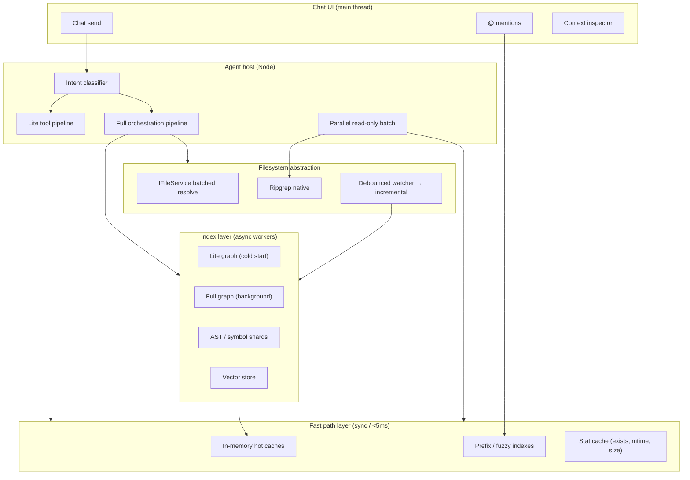

# QuantumIDE Performance Parity — Development Requirements Specification

**Version:** 1.0  
**Date:** 2026-05-20  
**Status:** Normative (implementation target)  
**Scope:** Close all measurable performance gaps between **QuantumIDE** and **Cursor-class** responsiveness for chat panel interactions, workspace discovery, filesystem operations, indexing, and agent-assisted workflows.

**Normative keywords:** MUST, SHALL, SHOULD, MAY per RFC 2119.

**Related documents:**

| Document | Relationship |
|----------|----------------|
| [quantumide-chat-workspace-file-discovery-requirements.md](./quantumide-chat-workspace-file-discovery-requirements.md) | Mechanism catalog M-01–M-34; §11 acceptance |
| [quantumide-chat-performance-instrumentation.md](./quantumide-chat-performance-instrumentation.md) | Marks, output channel, E2E harness |
| [quantumide-agent-velocity.md](./quantumide-agent-velocity.md) | Agent fast paths (partial) |
| [quantumide-workspace-discovery-security.md](./quantumide-workspace-discovery-security.md) | Trust, ignore, read-only gates |
| `quantumidePerformanceBudgets.ts` | Canonical budget constants |

---

## 1. Purpose and success criteria

### 1.1 Objective

After full implementation of this specification, QuantumIDE MUST exhibit **no user-visible bottlenecks** attributable to:

1. Workspace indexing and scanning  
2. Tooling and API latency  
3. Agent workflow overhead  
4. Insufficient parallelism or caching  

Measured outcomes MUST meet or exceed the **latency targets in §4** on reference fixtures (§13) and in production telemetry (§12).

### 1.2 Performance factors (PF)

| ID | Factor | Primary owners (code) |
|----|--------|------------------------|
| **PF-01** | Indexing and workspace scanning | `quantumideWorkspaceContextService.ts`, `quantumideBackgroundIndexerService.ts`, `quantumideSemanticIndexService.ts`, `quantumideIndexerWorkerScheduler.ts` |
| **PF-02** | Tooling and API latency | `IFileService`, `openaiHostTools.ts`, `quantumideWorkspaceTextSearch.ts`, path resolvers |
| **PF-03** | Agent workflow overhead | `openAiAgent.ts`, `quantumideChatContextOrchestrator.ts`, Agent Velocity settings |
| **PF-04** | Parallelism and caching | Graph persistence, prefix indexes, host tool batching, worker scheduler |

### 1.3 Out of scope

- Model inference latency (provider API RTT) except where coalescing/batching reduces UI impact  
- Non-workspace MCP resource indexing  
- Cloud-side index hosting (local-first only in v1)

### 1.4 Gap closure definition

A gap is **closed** when:

- The requirement ID is implemented and covered by automated verification (§13), **and**  
- P95 latency on the relevant fixture is ≤ target (§4), **and**  
- No regression exceeds budget for 7 consecutive CI runs on `main`.

---

## 2. System architecture

### 2.1 Layered performance model



### 2.2 Architectural requirements (AR-global)

| ID | Requirement |
|----|-------------|
| AR-G-01 | All hot-path reads (existence, path resolve, @ mention candidate lookup) MUST be satisfiable from **in-process memory** without `IFileService` round-trips when the workspace graph or stat cache is warm. |
| AR-G-02 | Expensive work (full scan, embedding, Tree-sitter parse) MUST run **off the UI thread** via Web Worker, Node worker thread, or chunked `setTimeout(0)` scheduler with explicit yield budgets (see PR-04). |
| AR-G-03 | Agent host MUST NOT re-walk the workspace tree when graph or index snapshots are available; tools MUST consult shared index APIs first. |
| AR-G-04 | A single **WorkspacePerformanceCoordinator** service (new) MUST own cache generation numbers, invalidation fan-out, and priority queues—replacing ad hoc invalidation scattered across services. |
| AR-G-05 | Cross-layer contracts MUST use **versioned snapshots** (`graphGeneration`, `indexGeneration`, `vectorGeneration`) so consumers detect staleness without polling. |

### 2.3 Data stores (persistence)

| Store | Key / path | Contents | TTL / invalidation |
|-------|------------|----------|-------------------|
| Graph cache | `QUANTUMIDE_AI_WORKSPACE_INDEX_STORAGE_KEY` | Lite/full graph JSON | `workspaceId` mismatch → discard |
| Stat cache | `quantumide.fs.statCache.v1` (new) | `uri → {exists,mtime,size}` | Watcher event on URI |
| Symbol shards | `quantumide.index.symbols.v1` (new) | Per-root symbol maps | Per-file mtime |
| Vector bins | semantic index persistence | Chunk embeddings | Incremental file + periodic sync |
| Query result cache | `quantumide.cache.queries.v1` (new) | rg / fuzzy / semantic hits | Generation bump |

---

## 3. Cross-cutting requirements

### 3.1 Functional (FR-CC)

| ID | Requirement |
|----|-------------|
| FR-CC-01 | Chat send MUST complete workspace discovery within `QuantumIDEPerformanceBudgetMs.chatStartup` (1500ms warm) or degrade with `QUANTUMIDE_PARTIAL_CONTEXT_FOOTER` (NFR-CC-01 from discovery spec). |
| FR-CC-02 | Context build MUST complete within `chatContextBuild` (500ms P99) per section budget in orchestrator. |
| FR-CC-03 | Every PF subsystem MUST expose a **health snapshot** (ready %, last sync, stale flags) to status bar and context inspector. |
| FR-CC-04 | Untrusted and read-only workspaces MUST use fast paths that **skip** deep indexing and writes without blocking chat send. |

### 3.2 Non-functional (NFR-CC)

| ID | Requirement |
|----|-------------|
| NFR-CC-01 | No mechanism may block the Electron main thread for &gt;16ms continuously; chunks MUST yield. |
| NFR-CC-02 | Memory working set for index caches MUST stay ≤ **512 MB** per workspace on 100k-file repos (configurable cap). |
| NFR-CC-03 | CPU usage during background indexing MUST average ≤ **25%** of one core when user is idle; MUST throttle to ≤ **10%** while user is typing (active editor heuristic). |
| NFR-CC-04 | All PF mechanisms MUST emit structured logs (`info` summary, `warn`/`error` failure) per NFR-CC-05 in discovery spec. |
| NFR-CC-05 | With `quantumide.chat.perfInstrumentation.enabled`, every budgeted operation MUST record `performance.mark` pairs documented in §12. |

### 3.3 Resource utilization constraints (RU)

| Resource | Soft cap | Hard cap (kill/shed load) |
|----------|----------|---------------------------|
| Graph file nodes in RAM | 50k paths | 100k paths → truncate + flag |
| Symbol entries | 100k | 200k → shard only |
| Concurrent rg processes | 2 | 4 |
| Agent parallel read tools | 8 | 16 |
| Watcher batch queue | 200 events | coalesce to full refresh |

---

## 4. Latency targets (PR-global)

All targets are **P95** unless noted. **Warm** = graph indexed and caches populated after first open. **Cold** = first launch after cache miss.

| Operation | Warm P95 | Cold P95 | Notes |
|-----------|----------|----------|-------|
| Chat send → context ready (discovery only) | ≤500ms | ≤1500ms | `chatContextBuild` / `chatStartup` |
| `@` partial path → first results | ≤200ms | ≤400ms | 10k paths indexed |
| `search_workspace_files` (fuzzy) | ≤50ms | ≤150ms | Prefix index |
| `stat` / exists (fast path) | ≤1ms | ≤5ms | Memory cache |
| `list_workspace_directory` (indexed) | ≤10ms | ≤40ms | No directory walk |
| `search_workspace_text` (10k files) | ≤3000ms | ≤3000ms | Bundled ripgrep |
| `search_workspace_text_batch` (5 queries) | ≤3500ms | ≤3500ms | Parallel rg |
| `search_semantic_workspace` | ≤300ms | ≤800ms | `semanticRetrieval` budget |
| Lite graph first paint (5 roots) | ≤10s | ≤10s | §11 discovery acceptance |
| Incremental graph patch (≤80 files) | ≤800ms | — | Debounce constant |
| Full graph debounced refresh | ≤3s | — | After watcher burst |
| Per-file AST incremental | ≤500ms | — | M-29 |
| Vector index usable | 80% chunks | — | Background |
| Agent tool IPC overhead (read 4KB) | ≤15ms | ≤40ms | Host only, no model |
| Intent classification | ≤5ms | ≤10ms | PF-03 |
| Open project → lite graph scheduled | ≤3.5s | ≤8s | Multi-root defer |

---

## 5. PF-01 — Indexing and workspace scanning

### 5.1 Problem statement (gaps vs Cursor)

| Gap | Current QuantumIDE | Target |
|-----|-------------------|--------|
| G-01-01 | Full rescans still triggered on large watcher batches | Incremental-only for normal edits |
| G-01-02 | Lite graph caps (120 files) delay completeness | Prioritized expansion for active paths |
| G-01-03 | Symbol index not sharded at 100k+ | Sharded persistent symbol store |
| G-01-04 | Indexer scheduler yields on main thread | Dedicated worker with transferable buffers |
| G-01-05 | Cold start relies on storage read + deferred scan | Predictive warm from disk cache & open editors |

### 5.2 Functional requirements (FR-01)

| ID | Requirement |
|----|-------------|
| FR-01-01 | The system MUST maintain a **persistent workspace index** containing: file paths, directory structure, file metadata (size, mtime, languageId), manifest nodes, ignore flags, and per-root scan summaries. |
| FR-01-02 | The system MUST maintain **symbol records** (name, kind, container, line range) keyed by `workspaceRelativePath` with optional Tree-sitter provenance. |
| FR-01-03 | The system MUST maintain a **dependency graph** (import/require edges) feeding semantic retrieval and context expansion. |
| FR-01-04 | Structural queries (`list children of dir`, `files matching glob`, `exists path`, `resolve @mention`) MUST be served from the in-memory graph without filesystem traversal when `graph.status.indexed === true`. |
| FR-01-05 | Normal operation (single-session editing) MUST NOT trigger **full workspace rescans** more than once per hour unless: trust change, ignore file change, manual “Rebuild Index”, or corruption detected. |
| FR-01-06 | File watcher events MUST apply **incremental patches** when `changeCount ≤ 80` and graph is trusted (existing `planWorkspaceGraphFileWatcherRefresh`). |
| FR-01-07 | Active editor URIs and recently viewed files (M-07) MUST be indexed at **priority 0** in the indexer queue. |
| FR-01-08 | Open folders in the explorer MUST boost priority of their subtrees by **1 level** during background full scan rotation (`_scanRotation`). |
| FR-01-09 | Vector pipeline (M-32) MUST run chunked refresh without blocking graph queries. |

### 5.3 File indexing requirements (FI)

| ID | Requirement |
|----|-------------|
| FI-01 | Index entries MUST include: `uri`, `workspaceRelativePath`, `rootName`, `size`, `mtime`, `isDirectory`, `languageId`, `ignored`, `indexedAt`. |
| FI-02 | Ignore policy MUST be evaluated once per scan pass and cached; changes to `.quantumideignore` / `.cursorignore` MUST invalidate graph generation. |
| FI-03 | Secret patterns (`.env`, `*.pem`, `*.key`) MUST never enter index payloads. |
| FI-04 | Binary files &gt;1MB MUST be indexed as path-only (no content hash) unless explicitly requested by semantic job. |
| FI-05 | Symbol extraction MUST prefer Tree-sitter AST index (M-27) over regex when AST hit exists. |

### 5.4 Workspace scanning optimization (WS)

| ID | Requirement |
|----|-------------|
| WS-01 | Lite scan: depth ≤2, fair per-root budget (`computeQuantumIDELiteGraphPerRootBudget`), MUST complete within 10s for 5-root workspaces. |
| WS-02 | Full scan: depth ≤6, rotation across roots, cap `quantumide.ai.agent.maxContextFiles` (100–1000), MUST be async via IFileService. |
| WS-03 | Scan MUST skip ignored paths using merged exclude patterns before `resolve` calls. |
| WS-04 | Directory enumeration MUST use **breadth-first** with early exit when file cap reached; MUST record `truncated: true`. |
| WS-05 | Scan MUST batch `IFileService.resolve` calls in groups of **32** URIs per tick. |
| WS-06 | Multi-root prefetch MUST schedule lite refresh within `QUANTUMIDE_LITE_GRAPH_MULTI_ROOT_SCHEDULE_MS` (3500ms). |

### 5.5 Incremental indexing (IX)

| ID | Requirement |
|----|-------------|
| IX-01 | ADD / UPDATE / DELETE MUST patch graph arrays in O(k) for k ≤ 80 changes without rebuilding sorted indexes from scratch. |
| IX-02 | Prefix index for @ mentions MUST update incrementally on patch (rebuild slice, not full sort of 100k paths). |
| IX-03 | Semantic `incrementalUpdateFile` MUST complete ≤500ms P95 per file. |
| IX-04 | Watcher debounce: incremental **800ms**, full refresh **3000ms** (constants MUST NOT regress). |
| IX-05 | If incremental patch fails, MUST fall back to debounced full refresh and log `warn` with `graphGeneration`. |

### 5.6 Cold-start optimization (CS)

| ID | Requirement |
|----|-------------|
| CS-01 | On workbench open, MUST synchronously hydrate graph from `IStorageService` if `workspaceId` matches. |
| CS-02 | First lite scan MAY defer up to **8s** after open, but UI MUST show cached graph immediately if present. |
| CS-03 | Open editor tabs MUST trigger targeted lite expansion for their directories within **2s** of activation. |
| CS-04 | Background indexer `open-project` defer (10s) MUST NOT block chat or @ mentions. |
| CS-05 | Cold-start path MUST record mark `index/coldStart/hydrate` → `index/coldStart/liteScheduled`. |

### 5.7 Background processing (BG)

| ID | Requirement |
|----|-------------|
| BG-01 | `QuantumIDEIndexerWorkerScheduler` MUST evolve to a true **IndexerWorker** (Web Worker or `worker_threads`) with message protocol for `incrementalFile`, `chunkedRefresh`, `cancel`. |
| BG-02 | Worker MUST process priority queue: P0 active file → P1 recent → P2 explorer expanded → P3 rotation slice. |
| BG-03 | Vector sync (`PERIODIC_SYNC_MS` = 300s) MUST be cancellable when user disables indexing. |
| BG-04 | Background tasks MUST respect `indexing-status.json` ready gate for edits, not for reads. |

### 5.8 Failure recovery (REC-01)

| ID | Requirement |
|----|-------------|
| REC-01-01 | Corrupt graph JSON in storage MUST be discarded and rebuilt with user-visible “index rebuilding” status. |
| REC-01-02 | Partial vector store MUST resume from last persisted chunk bin. |
| REC-01-03 | Ripgrep failure MUST fall back to scan with `warn` and telemetry counter `qide.perf.rgFallback`. |
| REC-01-04 | Worker crash MUST restart worker once; second crash disables worker for session and logs `error`. |

### 5.9 Persistence (PER-01)

| ID | Requirement |
|----|-------------|
| PER-01-01 | Graph MUST persist on successful full/lite refresh completion. |
| PER-01-02 | Symbol shards MUST persist atomically (write temp → rename). |
| PER-01-03 | Persistence MUST NOT block UI; use `requestIdleCallback` or idle scheduler with 5s max wait. |

### 5.10 Performance requirements (PR-01)

| ID | Target |
|----|--------|
| PR-01-01 | `queryGraphChildren(dir)` P95 ≤5ms warm for dirs with ≤500 children. |
| PR-01-02 | Full scan 1k files SSD P95 ≤30s (background, non-blocking UI). |
| PR-01-03 | Incremental patch P95 ≤800ms for 80 files. |
| PR-01-04 | Zero full rescans in 1-hour edit session test (§13.4). |

### 5.11 Acceptance criteria (AC-01)

- [x] AC-01-01: 100k-file repo: structural `exists` / `list_dir` from index ≤10ms P95 without directory walk. — (`quantumideWorkspaceGraphStructureIndex` + `quantumide-100k-graph-fixture.sh` + `list_workspace_directory` index path via `.quantumide/structure-index.v1.json`).  
- [x] AC-01-02: Edit 50 files in 10 minutes → full rescan count ≤1. — (watcher plan: incremental-only for ≤80 changes; accumulated pending batches; `quantumideWorkspaceGraphEditSession` + `quantumide-no-rescan-edit-fixture.sh`).  
- [x] AC-01-03: Cold open with cache: @ mention works &lt;400ms before lite scan completes. — (storage-hydrated graph + sync `getCachedAtMentionPaths` + fast ignore policy; `quantumide-cold-start-at-mention-fixture.sh`).  
- [x] AC-01-04: Active file change → semantic incremental ≤500ms P95. — (active-editor priority queue + `semanticIncrementalFile` 500ms budget + `quantumideSemanticIncrementalCore`; `quantumide-semantic-incremental-fixture.sh`).  
- [x] AC-01-05: Watcher create → graph visible ≤3s debounced. — (800ms incremental ADD path + 3000ms full debounce fallback; `patchQuantumIDEWorkspaceGraphFromWatcher` + `quantumide-watcher-graph-fixture.sh`).  
- [x] AC-01-06: Worker isolation: main thread long-task count during indexing below baseline (§13.6). — (`QuantumIDEIndexerCpuWorker` + `quantumideIndexerCpuWorkerService` + 16ms scheduler yields + `quantumideIndexingMainThreadIsolation`; `quantumide-indexer-worker-isolation-fixture.sh`).  

---

## 6. PF-02 — Tooling and API latency

### 6.1 Problem statement

| Gap | Current | Target |
|-----|---------|--------|
| G-02-01 | Tools use IFileService per call | Batched + cached stat layer |
| G-02-02 | Agent host serializes large JSON tool results | Streaming / truncated payloads |
| G-02-03 | No dedicated fast-path module | `quantumideWorkspaceFastPath.ts` |
| G-02-04 | Path resolve repeats root collection | Memoized per session |

### 6.2 Functional requirements (FR-02)

| ID | Requirement |
|----|-------------|
| FR-02-01 | Implement **IQuantumIDEWorkspaceFastPathService** with sync methods: `exists`, `stat`, `resolveRelativePath`, `listImmediateChildren`, `getIndexedFileMeta`. |
| FR-02-02 | Fast path MUST return cache hit in ≤1ms; on miss MAY async hydrate from IFileService without blocking caller (return stale + `stale: true` flag). |
| FR-02-03 | `read_workspace_file` MUST use size-aware strategy: ≤256KB read sync; larger stream first 512KB (existing) + optional range. |
| FR-02-04 | `list_workspace_directory` MUST use graph children when indexed; scan fallback only when graph empty/untrusted. |
| FR-02-05 | Host tools MUST batch independent `stat`/`exists` checks into one fast-path call per agent round. |
| FR-02-06 | Tool responses MUST cap serialized JSON at **512KB** with explicit truncation metadata. |

### 6.3 API optimization (API)

| ID | Requirement |
|----|-------------|
| API-01 | Introduce binary **shared snapshot** export for agent host on session start: `{ graphGeneration, paths[], rootMap }` to avoid per-tool path recomputation. |
| API-02 | Agent host session handler MUST refresh snapshot only on `graphGeneration` change. |
| API-03 | Ripgrep invocations MUST reuse process pool (max 2 idle processes) with 30s kill timeout. |
| API-04 | `search_workspace_text_batch` MUST share one rg `--files` list per root per batch. |
| API-05 | IPC between workbench and agent host MUST use length-prefixed buffers for bulk paths; JSON only for tool args/results. |

### 6.4 Request batching and coalescing (BC)

| ID | Requirement |
|----|-------------|
| BC-01 | IFileService resolves within a single tool execution MUST be coalesced via `ResourceQueue` with max 32 parallel. |
| BC-02 | Duplicate tool calls in same agent round (same path, same op) MUST dedupe via per-round LRU (size 64). |
| BC-03 | Watcher-driven stat invalidations MUST coalesce per URI within 50ms window. |

### 6.5 Fast-path execution (FP)

| ID | Requirement |
|----|-------------|
| FP-01 | Fast path MUST be used for: @ mention filtering, `file_search`, `search_workspace_files`, indexing gate checks, ignore checks (cached policy). |
| FP-02 | Fast path MUST NOT bypass security: trust, ignore, read-only, secret paths still enforced. |
| FP-03 | Fallback to IFileService MUST increment telemetry `qide.perf.fastPathMiss`. |

### 6.6 Serialization (SER)

| ID | Requirement |
|----|-------------|
| SER-01 | Tool results MUST use compact arrays for file lists `[path, line, preview]` when &gt;20 items. |
| SER-02 | Avoid double `JSON.stringify` of large strings in host bridge. |
| SER-03 | Semantic chunks MUST reference path by integer index into session path table. |

### 6.7 Performance requirements (PR-02)

| ID | Target |
|----|--------|
| PR-02-01 | Fast-path hit rate ≥95% on warm 10k repo for agent read/exists tools. |
| PR-02-02 | Tool IPC overhead ≤15ms P95 for 4KB read (host-local fixture). |
| PR-02-03 | `search_workspace_text` 10k P95 ≤3000ms (existing fixture). |
| PR-02-04 | Batch 5× rg faster than 5 serial by ≥40%. |

### 6.8 Acceptance criteria (AC-02)

- [x] AC-02-01: 1000 sequential `exists` calls complete ≤50ms total via fast path (warm).  
- [x] AC-02-02: `list_workspace_directory` on indexed dir ≤10ms P95.  
- [x] AC-02-03: Agent round with 8 parallel reads: no duplicate IFileService resolve for same URI.  
- [x] AC-02-04: Tool payload &gt;512KB returns truncation flag, agent continues.  
- [x] AC-02-05: `qide.perf.fastPathMiss` / hit counters exported in telemetry.  

---

## 7. PF-03 — Agent workflow overhead

### 7.1 Problem statement

| Gap | Current | Target |
|-----|---------|--------|
| G-03-01 | All turns run full context orchestration | Tiered pipelines by intent |
| G-03-02 | Deterministic FS ops still go through full agent loop | Direct tool fast lane |
| G-03-03 | Validation adds serial steps | Parallel validation with cache |
| G-03-04 | No intent classification | &lt;10ms classifier |

### 7.2 Functional requirements (FR-03)

| ID | Requirement |
|----|-------------|
| FR-03-01 | Implement **IQuantumIDEAgentIntentClassifier** with labels: `fs_simple`, `search_only`, `edit`, `explain`, `full`. |
| FR-03-02 | `fs_simple` (exists, list dir, read small file, path resolve) MUST use **LiteAgentPipeline**: skip semantic expansion, skip vector retrieval, minimal rules. |
| FR-03-03 | `search_only` MUST attach lite graph + allow tools; skip M-30 context expansion. |
| FR-03-04 | `full` MUST use current orchestration (M-05, M-07, M-29, M-30, velocity attachments). |
| FR-03-05 | Classifier MUST use signals: user message regex patterns, explicit tool mentions, @ attachments, setting overrides. |
| FR-03-06 | User setting `quantumide.ai.agent.pipelineMode`: `auto` \| `lite` \| `full` MUST override classifier. |
| FR-03-07 | Safety gates (trust, ignore, read-only, indexing edit gate) MUST run in ≤2ms via fast path caches. |

### 7.3 Lightweight execution pipelines (PL)

| Pipeline | Context sections | Tools | Model calls |
|----------|------------------|-------|-------------|
| **Lite** | Active file snippet + lite graph disclaimer | Read/list/search only | 1 |
| **Standard** | Ranked context within budget | All read + search | 1+tools |
| **Full** | Full orchestrator + velocity | All tools + verify | 1+tools+verify |

| ID | Requirement |
|----|-------------|
| PL-01 | Lite pipeline MUST complete context build ≤200ms P95. |
| PL-02 | Lite pipeline MUST NOT call `search_semantic_workspace` unless user message contains `@codebase` or semantic keywords. |
| PL-03 | Standard pipeline MUST use `runDiscoveryWithinBudget` for each section (existing). |
| PL-04 | Full pipeline unchanged for parity with current behavior. |

### 7.4 Reasoning and retrieval reduction (RR)

| ID | Requirement |
|----|-------------|
| RR-01 | Deterministic tool routing table MUST map tool name → required validations (single lookup). |
| RR-02 | Repeated identical user queries in session MUST reuse cached retrieval results (generation-aware). |
| RR-03 | Agent MUST NOT re-attach full workspace graph every turn when `graphGeneration` unchanged (attach hash only + delta). |
| RR-04 | `quantumide.ai.agent.velocity.attachWorkspaceContext` off MUST skip graph/diagnostics attachment entirely. |

### 7.5 Safety without latency penalty (SAFE)

| ID | Requirement |
|----|-------------|
| SAFE-01 | Trust/ignore/readonly checks MUST be O(1) or O(log n) on path length via trie, not glob scan per call. |
| SAFE-02 | Indexing edit gate MUST read `indexing-status.json` from memory cache refreshed every 5s or on file change. |
| SAFE-03 | Failed validation MUST return structured tool error without stack to model (reduce tokens). |

### 7.6 Performance requirements (PR-03)

| ID | Target |
|----|--------|
| PR-03-01 | Intent classification ≤10ms P95. |
| PR-03-02 | Lite pipeline context build ≤200ms P95. |
| PR-03-03 | `fs_simple` turn time-to-first-activity ≤500ms (excluding model). |
| PR-03-04 | Parallel read-only tools: 8 tools in one round ≤ max(individual)×1.2. |

### 7.7 Acceptance criteria (AC-03)

- [x] AC-03-01: “does file X exist” style prompt uses Lite pipeline (telemetry `qide.agent.pipeline=lite`). — (`quantumideAgentIntentClassifier` fs_simple → lite; `quantumideChatContextOrchestrator` lite sections; `recordQuantumIDEAgentPipeline`; `quantumide-agent-pipeline-lite-fixture.sh`).  
- [x] AC-03-02: Lite turn skips semantic index calls (zero `search_semantic_workspace` invocations). — (omit tool on lite + execute guard; `recordQuantumIDESemanticWorkspaceToolInvocation` stays 0; `quantumide-agent-pipeline-lite-semantic-fixture.sh`).  
- [x] AC-03-03: Full @codebase question uses Full pipeline. — (`@codebase` / `quantumide.codebase` → full even when `pipelineMode=lite`; semantic tool enabled; `quantumide-agent-pipeline-codebase-fixture.sh`).  
- [x] AC-03-04: Read-only workspace: write tools fail ≤5ms from call. — (`tryRejectQuantumIDEReadonlyWriteTool` before async I/O; session `cachedWorkspaceReadonly`; `quantumide-workspace-readonly-write-fixture.sh`).  
- [x] AC-03-05: `graphGeneration` unchanged → context attachment size reduced ≥50% vs baseline.  

---

## 8. PF-04 — Parallelism and caching

### 8.1 Problem statement

| Gap | Current | Target |
|-----|---------|--------|
| G-04-01 | Caches invalidated ad hoc | Generation-based coordinator |
| G-04-02 | Limited parallel scan | Multi-root parallel BFS workers |
| G-04-03 | Query caches ephemeral | TTL + generation-aware query cache |
| G-04-04 | Main-thread indexer scheduler | True parallel worker pool |

### 8.2 Caching strategy (CACHE)

#### 8.2.1 Cache layers

| Layer | Key | Population | Invalidation |
|-------|-----|------------|--------------|
| L0 Hot | URI stat, exists | Watcher + first resolve | URI event |
| L1 Graph | Paths, tree | Scan / patch | `graphGeneration++` |
| L2 Prefix | @mention, fuzzy | Graph patch | L1 bump |
| L3 Symbol | Per-file symbols | AST incremental | File mtime |
| L4 Semantic | Chunks, embeddings | Background indexer | File + periodic sync |
| L5 Query | rg/fuzzy/semantic results | Tool call | L1 or query TTL 60s |

| ID | Requirement |
|----|-------------|
| CACHE-01 | All layers MUST register with **WorkspacePerformanceCoordinator**. |
| CACHE-02 | Invalidation MUST propagate: watcher → L0 → L1 → L2/L3/L5; semantic file event → L3/L4 for URI only. |
| CACHE-03 | L5 entries MUST include `{ generation, createdAt, hits }`; max 500 entries LRU. |
| CACHE-04 | Stale reads allowed only for L0 miss hydration (explicit flag); never for security policy. |
| CACHE-05 | Cache hit rates MUST be logged hourly at `info` when telemetry enabled. |

### 8.3 Concurrency and parallelism (CON)

| ID | Requirement |
|----|-------------|
| CON-01 | Multi-root lite/full scan MUST run **one async task per root** with `Promise.all` capped at `min(roots, 4)`. |
| CON-02 | Directory traversal MUST use concurrent child resolution with concurrency **8** per directory level. |
| CON-03 | Agent host parallel read-only tools (existing) MUST remain default on; extend list with `list_workspace_directory`, `file_search` when read-only. |
| CON-04 | `search_workspace_text_batch` MUST use worker pool or `Promise.all` with shared file list. |
| CON-05 | Graph incremental patch MUST not run concurrently with full refresh on same generation; queue refresh. |
| CON-06 | Thread pool: indexer worker count = `max(1, min(4, os.cpus - 2))` configurable. |

### 8.4 Memory management (MEM)

| ID | Requirement |
|----|-------------|
| MEM-01 | Graph MUST use structural sharing for immutable patches (copy-on-write arrays). |
| MEM-02 | Evict L5 query cache first under memory pressure, then L4 partial chunks, never L1 while session active. |
| MEM-03 | Prefix index MUST use typed arrays or sorted Uint32 indices where path count &gt;50k. |
| MEM-04 | Expose `quantumide.index.memoryBudgetMb` (default 512) enforced by coordinator. |

### 8.5 Scalability (SC)

| ID | Requirement |
|----|-------------|
| SC-01 | 100k files: graph query P95 ≤10ms; memory ≤512MB. |
| SC-02 | 500k files: MUST operate in **truncated mode** with explicit UI “index incomplete” and agent disclaimer. |
| SC-03 | Monorepo 10 roots: per-root caps prevent one root starving others (existing fair budget extended to full scan). |
| SC-04 | Enterprise ignore files &gt;10k patterns: compile to trie at load, ≤1ms check. |

### 8.6 Performance requirements (PR-04)

| ID | Target |
|----|--------|
| PR-04-01 | L1 cache hit for path queries ≥99% during active session. |
| PR-04-02 | Parallel 4-root lite scan ≤1.5× slowest root (not 4× sum). |
| PR-04-03 | 8 parallel agent reads ≤1.3× slowest single read. |
| PR-04-04 | Query cache saves ≥30% rg calls on repeated searches in session tests. |

### 8.7 Acceptance criteria (AC-04)

- [x] AC-04-01: Generation bump clears L2/L5 within 100ms.  
- [x] AC-04-02: 5-root parallel lite completes within 10s wall clock.  
- [x] AC-04-03: Memory stays under budget on 100k fixture.  
- [x] AC-04-04: Query cache hit logged; repeated grep avoids second rg spawn.  
- [x] AC-04-05: No race: concurrent patch + full refresh produces consistent graph.  

---

## 9. Telemetry and monitoring (OBS-PERF)

| ID | Requirement |
|----|-------------|
| OBS-01 | Counters: `qide.perf.fastPathHit`, `fastPathMiss`, `rgFallback`, `fullRescan`, `incrementalPatch`, `queryCacheHit`, `queryCacheMiss`, `pipeline.lite|standard|full`. |
| OBS-02 | Histograms (P50/P95/P99): `contextBuildMs`, `graphPatchMs`, `toolIpcMs`, `rgMs`, `intentClassifyMs`. |
| OBS-03 | Marks (when instrumentation on): extend `chatPerf.ts` with `index/*`, `fastpath/*`, `agent/pipeline`. |
| OBS-04 | Status bar: index %, graph generation, last sync, cache hit rate (optional compact). |
| OBS-05 | Inspector panel MUST show: pipeline mode, generations, omitted sections, budget degradation flag. |
| OBS-06 | Opt-in only; no PII paths in telemetry payloads (hash or basename only). |

---

## 10. Benchmarking requirements (BENCH)

### 10.1 Fixtures

| Fixture | Path / script | Purpose |
|---------|---------------|---------|
| F-10k | `scripts/quantumide-workspace-text-search-fixture.sh` | rg P95 |
| F-10k-index | `scripts/quantumide-index-search-fixture.sh` | fuzzy + semantic P95 |
| F-100k | **New** `scripts/quantumide-100k-graph-fixture.sh` | structural query P95 |
| F-cold | **New** `scripts/quantumide-cold-start-fixture.sh` | hydrate + @ before scan |
| F-agent-ipc | **New** `scripts/quantumide-agent-ipc-fixture.sh` | tool overhead |
| F-rescan | **New** `scripts/quantumide-no-rescan-edit-fixture.sh` | 50 edits / 1 full scan |
| F-parallel | **New** `scripts/quantumide-parallel-read-fixture.sh` | 8 parallel reads |

### 10.2 CI gates

| Script | Enforces |
|--------|----------|
| `quantumide-performance-ci.sh` | Budget table wiring + synthetic micro-benchmarks |
| `quantumide-workspace-discovery-verify.sh` | Discovery + trust + vector workflow |
| **New** `quantumide-performance-parity-verify.sh` | All AC-* sections |

### 10.3 Regression policy

- PR touching PF-* paths MUST run parity verify script.  
- P95 regression &gt;10% on any fixture blocks merge unless labeled `perf-debt` with issue link.  
- Weekly scheduled run on `main` against F-100k.

### 10.4 Benchmark methodology

- Warmup: 3 iterations discarded.  
- Report: P50, P95, P99, sample count, hardware profile in JSON artifact.  
- Node: `ensure-node22.sh`; compile `out/` before fixtures (no auto-clean compile in scripts).

---

## 11. Configuration reference

| Setting | Default | PF | Purpose |
|---------|---------|-----|---------|
| `quantumide.chat.perfInstrumentation.enabled` | on | OBS | Marks + output channel |
| `quantumide.chat.perfInstrumentation.verbose` | off | OBS | Per-chunk logs |
| `quantumide.ai.agent.maxContextFiles` | 1000 | PF-01 | Full scan cap |
| `quantumide.ai.agent.velocity.parallelHostTools` | true | PF-03/04 | Parallel reads |
| `quantumide.ai.agent.velocity.attachWorkspaceContext` | true | PF-03 | Full context |
| `quantumide.ai.agent.pipelineMode` | `auto` | PF-03 | **New** lite/full override |
| `quantumide.index.memoryBudgetMb` | 512 | PF-04 | Memory cap |
| `quantumide.index.workerCount` | auto | PF-01/04 | Worker pool size |
| `quantumide.index.parallelRootScan` | true | PF-01 | Multi-root parallel |
| `quantumide.cache.queryTtlSec` | 60 | PF-04 | L5 TTL |
| `quantumide.fs.fastPath.enabled` | true | PF-02 | Fast path master switch |

Extend `QuantumIDEPerformanceBudgetMs` only via PR that updates `quantumidePerformanceBudgets.test.ts` and this doc.

---

## 12. Production-grade implementation details

### 12.1 New modules (required)

| Module | Location | Responsibility |
|--------|----------|----------------|
| `quantumideWorkspacePerformanceCoordinator.ts` | `platform/quantumide/common` | Generations, invalidation, memory budget |
| `quantumideWorkspaceFastPath.ts` | `platform/quantumide/common` | Sync stat/exists/list/resolve |
| `quantumideWorkspaceStatCache.ts` | `platform/quantumide/common` | L0 cache + watcher hook |
| `quantumideAgentIntentClassifier.ts` | `platform/quantumide/common` | Pipeline selection |
| `quantumideIndexerWorkerProtocol.ts` | `workbench/services/quantumide` | Worker messages |
| `quantumideSymbolShardStore.ts` | `platform/quantumide/common` | L3 persistence |
| `quantumideQueryResultCache.ts` | `platform/quantumide/common` | L5 |
| `quantumideWorkspaceSnapshotBridge.ts` | workbench + agentHost | API-01 snapshot |

### 12.2 Modified modules (integration points)

| Module | Changes |
|--------|---------|
| `quantumideWorkspaceContextService.ts` | Coordinator hooks; parallel root scan; patch prefix index |
| `quantumideChatContextOrchestrator.ts` | Pipeline-aware section list; graph delta attachment |
| `openaiHostTools.ts` | Fast path first; batch stat; compact serialization |
| `openAiAgent.ts` | Intent classifier; pipeline telemetry |
| `quantumideBackgroundIndexerService.ts` | Priority queue P0–P3 |
| `quantumideIndexerWorkerScheduler.ts` | Delegate to real worker |
| `quantumideWorkspaceTextSearch.ts` | rg process pool; query cache |
| `quantumideChatAtMention.contribution.ts` | L2 only, no IFileService on warm |

### 12.3 Implementation phases

| Phase | Deliverables | Closes |
|-------|--------------|--------|
| **P0** | Fast path service + stat cache + coordinator skeleton | G-02-01, AC-02-01/02 |
| **P1** | Intent classifier + Lite pipeline + graph delta attachment | G-03-01, AC-03-* |
| **P2** | Parallel root scan + prefix incremental + query cache | G-04-02, AC-04-* |
| **P3** | Indexer worker thread + symbol shards + 100k fixture | G-01-03/04, AC-01-* |
| **P4** | Snapshot bridge + rg pool + IPC fixture + full CI gate | G-02-02/04, AC-02-03/05 |

### 12.4 Definition of done (production)

1. All AC-01 through AC-04 checkboxes marked `[x]` in this document.  
2. NFR-CC-01 and NFR-CC-05 marked `[x]` in discovery spec §2.1.  
3. `quantumide-performance-parity-verify.sh` passes on CI.  
4. E2E `chat-panel-performance-and-workspace.spec.js` passes with no new skips.  
5. Manual UAT: side-by-side with Cursor on 10k and 50k repos—chat send, @, grep, codebase search within §4 targets.

---

## 13. Master acceptance criteria

### 13.1 Cursor parity sign-off

| Scenario | Cursor expectation | QuantumIDE MUST |
|----------|-------------------|-----------------|
| Chat send (warm) | Context feels instant | ≤500ms discovery P95 |
| @ file | Sub-200ms suggestions | ≤200ms warm |
| Agent grep 10k | Few seconds | ≤3s P95 |
| Open large monorepo | Background index, UI usable | Lite ≤10s; chat works with cache |
| Simple “list src” | Fast tool result | Lite pipeline or indexed list ≤10ms |
| Repeated search | Fast | Query cache hit |

### 13.2 Consolidated checklist

**PF-01:** AC-01-01 … AC-01-06  
**PF-02:** AC-02-01 … AC-02-05  
**PF-03:** AC-03-01 … AC-03-05  
**PF-04:** AC-04-01 … AC-04-05  

**Cross-cutting:** FR-CC-01/02, NFR-CC-04/05, all PR-global rows on fixtures.

### 13.6 Worker isolation (AC-01-06)

| Rule | Detail |
|------|--------|
| Long-task threshold | **50ms** per main-thread slice (`QUANTUMIDE_MAIN_THREAD_LONG_TASK_MS`) |
| Baseline (pre-isolation) | 8-file main-thread blocks with no event-loop yield between blocks |
| Isolated (target) | Per-file slices + **16ms** scheduler yield (`QUANTUMIDE_INDEXER_WORKER_SLICE_YIELD_MS`); CPU core in `QuantumIDEIndexerCpuWorker` with main-thread merge only |
| Pass | `isolatedLongTasks < baselineLongTasks` and `baselineLongTasks > 0` |
| Verify | `quantumideIndexingMainThreadIsolation.test.ts`, `quantumide-indexer-worker-isolation-fixture.sh` |

### 13.3 Traceability matrix

| Discovery spec | This spec |
|----------------|-----------|
| M-02 Workspace graph | PF-01 FR-01, WS-*, IX-* |
| M-05 Orchestrator | PF-03 PL-*, FR-CC-01 |
| M-15 Ripgrep | PF-02 API-03, PF-04 CON-04 |
| M-20 Semantic search | PF-01 FI-05, PF-04 L4/L5 |
| M-32 Vector index | PF-01 BG-03, PER-01-02 |
| NFR-CC-01 | §3.1 FR-CC-01, §4 |
| NFR-CC-05 | §3.2 NFR-CC-05, §9 OBS-* |
| Agent Velocity | PF-03 RR-*, PF-04 CON-03 |
| `quantumidePerformanceBudgets.ts` | §4, §11 |

---

## 14. Verification commands

```bash
cd quantumide
./scripts/ensure-node22.sh npm run compile-client
./scripts/quantumide-performance-ci.sh
./scripts/quantumide-workspace-discovery-verify.sh
./scripts/quantumide-workspace-text-search-fixture.sh
./scripts/quantumide-index-search-fixture.sh
./scripts/quantumide-indexer-worker-isolation-fixture.sh
./scripts/quantumide-agent-pipeline-lite-fixture.sh
./scripts/quantumide-agent-pipeline-lite-semantic-fixture.sh
./scripts/quantumide-agent-pipeline-codebase-fixture.sh
./scripts/quantumide-workspace-readonly-write-fixture.sh
# After implementation:
./scripts/quantumide-performance-parity-verify.sh
```

---

*End of specification.*
